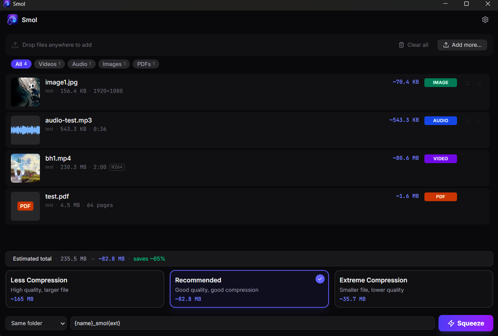

<div align="center">
  
  <h1>Smol</h1>
  <h3>A fast, native Windows desktop app for compressing video, audio, image, and PDF files. Drop any mix of files onto the app — Smol handles the rest.</h3>
  
  <p>
    
    
    
  </p>

  <br />

  <a href="https://github.com/Metwalley/Smol/releases/latest/download/Smol_1.0.0_x64-setup.exe">
    
  </a>
  <p><em>Requires Windows 10 or Windows 11 (64-bit)</em></p>

  <br />
  
</div>

---

## What it does

Drop any combination of video, audio, image, and PDF files onto Smol. Choose a compression preset, pick an output folder, and hit Squeeze. Smol compresses everything in the queue and shows you exactly how much space you saved. 

All processing happens **100% locally on your machine**. No files are ever uploaded to the internet, guaranteeing complete privacy and blazing fast speeds.

## Features in Detail

### 1. Unified Universal Queue
Unlike most tools that force you to process videos and images separately, Smol uses a single, unified queue. You can drag and drop an MP4 video, a JPEG image, an MP3 audio file, and a PDF document into the app all at once. Smol intelligently routes each file to the correct underlying compression engine (FFmpeg for media, Ghostscript for PDFs, and Rust-native libraries for images).

### 2. Per-File Precision Control
While Smol offers 4 global presets (Less Compression, Recommended, Extreme Compression, Lossless) for one-click processing, you can also override settings on a file-by-file basis. By clicking on any file in the queue, you can set a specific Target Size (e.g., exactly 8MB for Discord attachments), change the preset just for that file, or toggle image resizing.

### 3. Hardware Acceleration
Video encoding is notoriously slow on software, so Smol automatically detects your computer's graphics hardware. If you have an NVIDIA (NVENC), Intel (Quick Sync), or AMD (AMF) graphics card, Smol will instantly bypass your CPU and use the hardware encoder to compress videos at blistering speeds, falling back to standard software encoding only if hardware isn't available.

### 4. Fluid, Seamless UI
Built with React, Tailwind CSS, and Framer Motion, the interface is designed to feel completely native and fluid. From the seamless transition of the empty state to the physics-based spring animations when dropping files, the app feels responsive and premium.

---

## See it in action

### Seamless Compression Flow
<video src="https://github.com/Metwalley/Smol/raw/master/Marketing-Assets/compression_flow.mp4" controls width="100%"></video>

### Precision Per-File Settings
Need to change the target size for just *one* file in a massive batch? Just expand it.


### Massive Savings
Know exactly how much space you're saving in real-time.


---

## Building from source

**Prerequisites:** Rust stable, Node.js 22+, pnpm 9+

```bash
git clone https://github.com/Metwalley/Smol
cd Smol
pnpm install
node scripts/fetch-ffmpeg.mjs
node scripts/fetch-ghostscript.mjs
pnpm tauri dev
```

*Note: The app relies on pinned sidecar binaries (FFmpeg and Ghostscript) which are fetched via the scripts above. The app will not start without them.*

---

## License

Smol is licensed under the **GNU Affero General Public License v3.0**.
